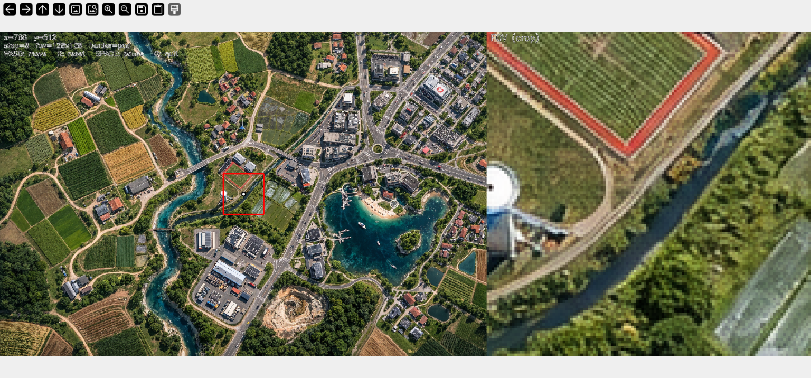

# **MicroUAV_2D Simulation Environment**


An **ultra-lightweight** 2D planar "down-camera" UAV sandbox for **rapid navigation logic prototyping**.

MicroUAV_2D is a **minimal CPU-only simulator** designed for testing **XY motion policies** over static overhead imagery. It provides:

-   A controllable point-drone.
-   A fixed-size sensor footprint (FOV crop).
-   Border-stable observation extraction.
-   A real-time OpenCV visualization interface.

This project is intentionally simple: no physics, no SLAM, no NDVI, no reward logic.

> It is a **perception-to-action** sandbox.

------------------------------------------------------------------------

## Core Concept



The simulator models a single point drone flying over a top-down map at a fixed height.

At each timestep:

1.  The drone has a pixel position `(x, y)` on the image.
2.  A square or rectangular field-of-view (FOV) is extracted around that
    position.
3.  That crop represents the "camera observation".
4.  A discrete action updates position.

The red square drawn on the global map is exactly the region returned
by:

``` python
obs = sim.get_observation()
```

There is no mismatch between visualization and observation tensor.

------------------------------------------------------------------------

## Features

-   4-direction discrete motion (WASD).
-   Configurable step size.
-   Configurable FOV size (square or rectangular).
-   Two border modes:
    -   `pad` → zero-padded, fixed observation size.
    -   `clamp` → crop shrinks near borders.
-   Optional image resizing on load.
-   Clean separation between simulator core and control logic.
-   Zero external frameworks beyond NumPy + OpenCV.

------------------------------------------------------------------------

## Folder Structure

```
    MicroUAV_2D/
    ├── simulator/
    │   ├── __init__.py
    │   ├── core.py
    │   ├── io.py
    │   ├── render.py
    │   └── viewer.py
    │
    ├── assets/
    │   ├── sample_map.png            # AI-generated aerial image
    │   ├── agridrone_rl_demo.gif     # autonomous motion example
    │   └── Sreenshot.png             # Live simulator screenshot
    │
    ├── README.md
    ├── LICENSE
    └── pyproject.toml
```

------------------------------------------------------------------------

## Installation

### 1. Create virtual environment (recommended)

``` bash
python3 -m venv venv
source venv/bin/activate
```

### 2. Install in editable mode

``` bash
pip install -e .
```

This installs:

-   numpy
-   opencv-python

and registers CLI command:

    microuav_2d

------------------------------------------------------------------------

## Running the Simulator

Basic run:

``` bash
microuav_2d --map assets/sample_map.png
```

------------------------------------------------------------------------

## CLI Arguments

```
  Argument      |Description                  |Default
  --------------|-----------------------------|----------
  `--map`       |Path to overhead image       |required
  `--fov`       |Square FOV size              |128
  `--fov_w`     |Optional FOV width           |None
  `--fov_h`     |Optional FOV height          |None
  `--step`      |Movement step size (pixels)  |8
  `--border`    |`pad` or `clamp`             |pad
  `--resize_h`  |Resize height                |None
  `--resize_w`  |Resize width                 |None
```

Resize requires both height and width.

Example:

``` bash
microuav_2d --map assets/sample_map.png --fov 256 --step 16
```

------------------------------------------------------------------------

## Controls

```
  Key      |Action
  ---------|----------------
  W        |Move up
  S        |Move down
  A        |Move left
  D        |Move right
  R        |Reset position
  SPACE    |Pause
  Q / ESC  |Quit
```

------------------------------------------------------------------------

## Border Handling Modes

### pad (default)

-   Observation always has shape `(fov_h, fov_w, 3)`.
-   Near borders, missing areas are zero-padded.
-   Best for ML pipelines that require fixed input shape.

### clamp

-   Crop shrinks near edges.
-   Output shape may vary.
-   More literal image slicing behavior.

------------------------------------------------------------------------

## Observation Model

The observation returned by:

``` python
obs = sim.get_observation()
```

is:

-   uint8.
-   BGR format.
-   Shape `(fov_h, fov_w, 3)`.
-   Centered exactly at drone position.

The overlay rectangle in the left panel matches this region exactly.

------------------------------------------------------------------------

## Using Your Own Map

Replace:

```
    assets/sample_map.png
```

with your own overhead image.

Requirements:

-   Top-down view
-   PNG or JPG
-   RGB or grayscale supported

Example:

``` bash
microuav_2d --map my_satellite_image.png
```

------------------------------------------------------------------------

## Adding Autonomous Logic

To implement autonomous control:

Edit:

    simulator/viewer.py

Inside the main loop, replace keyboard control logic with:

``` python
obs = sim.get_observation()
action = my_policy(obs)
sim.step(action)
```

Where:

    action ∈ {0, 1, 2, 3}

Mapping:

-   0 = up
-   1 = right
-   2 = down
-   3 = left

The simulator core (`core.py`) should not be modified.

### Reference Implementation (Author’s Prior Work)

If you want a concrete example of how autonomy logic can be built on top of this exact **“overhead map + local FOV crop + discrete actions”** idea, refer to the author’s earlier project:

**AgriDroneRL**: a vision-based drone navigation and coverage over top-down satellite imagery using a discrete action space and local observation patches. 
 
GitHub: **https://github.com/aymisxx/AgriDroneRL**


AgriDroneRL demonstrates how to:

- treat the local FOV crop as the observation input.
- run a policy that selects from `{up, right, down, left}`.
- evaluate navigation and coverage behavior over long rollouts.
- structure autonomy logic cleanly without entangling the simulator kernel.

**MicroUAV_2D** is the **generalized**, **domain-agnostic** version of that environment:  

no NDVI/VARI, no reward shaping, no domain assumptions, just a clean navigation sandbox.

------------------------------------------------------------------------

## Design Philosophy

MicroUAV_2D is not meant to be a full simulator.

It is:

-   A deterministic observation generator.
-   A minimal discrete-motion sandbox.
-   A rapid prototyping environment for:
    -   Reinforcement learning.
    -   Quick Policy debugging.
    -   Rule-based navigation.
    -   Vision-based motion.

No default physics.\
No default dynamics.\
No sensors beyond image crop.\
No domain assumptions (agriculture, urban, etc).

It is domain-agnostic.

------------------------------------------------------------------------

## Future (Tentative) Roadmap

Potential future versions:

-   v0.2: Policy interface module.
-   v0.3: Continuous action mode.
-   v0.4: Multi-agent extension.
-   v0.5: Swarm support.
-   v1.0: Modular autonomy plugin system.

------------------------------------------------------------------------

## Author

### **Ayushman M.** 

> https://www.linkedin.com/in/aymisxx/

> https://github.com/aymisxx  


------------------------------------------------------------------------

## License

> MIT LICENSE

------------------------------------------------------------------------